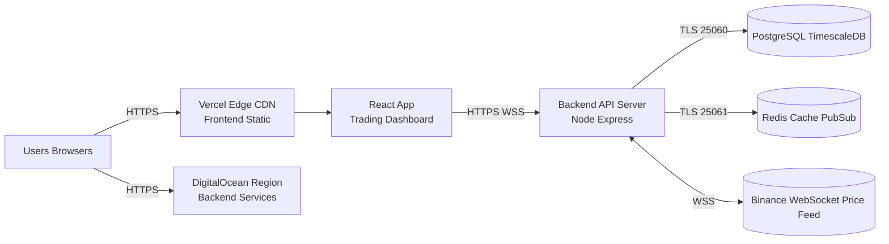
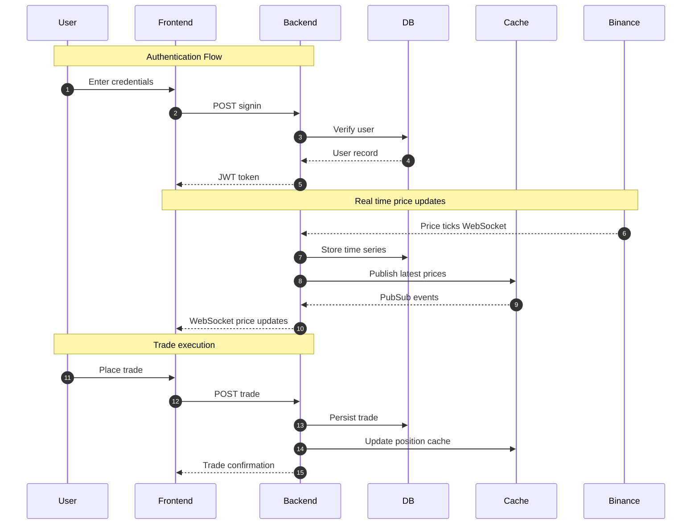
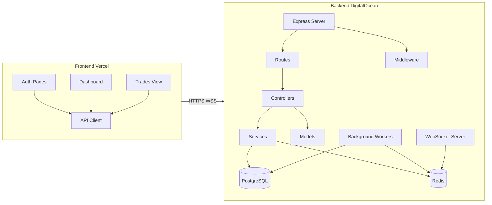
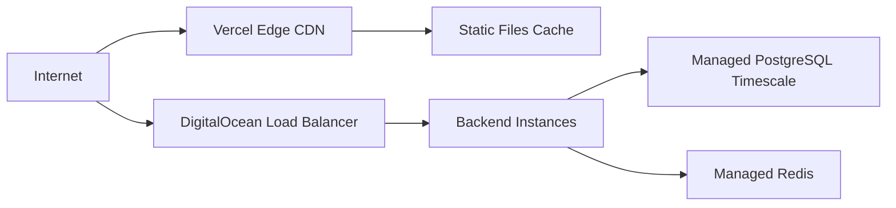
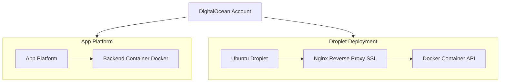
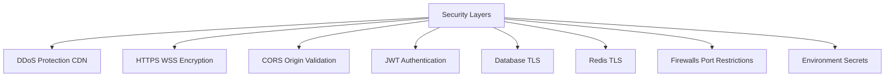

## Exness Trading Dashboard – Monorepo

This repository contains a **full-stack trading dashboard** inspired by the Exness trading experience. It provides:

- **Modern web frontend** for authentication, account overview, live charts, and trade management.
- **Low-latency backend** for user authentication, position and PnL calculation, and real‑time market feeds.
- **Production‑ready deployment setup** targeting **Vercel** (frontend) and **DigitalOcean** (backend, PostgreSQL/TimescaleDB, Redis).

The goal of the project is to demonstrate a realistic, production‑grade architecture for a **retail trading platform** that can be taken from local development all the way to a secure, scalable cloud deployment.

---

## What This Application Does

- **User authentication & accounts**
  - Email/password sign up & sign in backed by PostgreSQL.
  - JWT‑based session management between frontend and backend.
  - Auth‑gated access to the trading dashboard.

- **Real‑time market data**
  - Connects to **Binance WebSocket feeds** for price updates.
  - Normalizes and stores prices in **TimescaleDB** (PostgreSQL extension) for historical queries.
  - Streams live price updates to the frontend over a WebSocket server.

- **Trading & positions**
  - Allows users to submit trades through a REST API (`POST /api/v1/trade`).
  - Validates requests (auth, balance, basic risk checks).
  - Persists trades and positions in PostgreSQL.
  - Uses Redis for caching and fast PnL calculations.
  - Broadcasts trade confirmations and updated PnL over WebSocket to all relevant clients.

- **Analytics & dashboard views**
  - Interactive charts powered by `lightweight-charts` and/or `recharts`.
  - Panels for open positions, trade history, and performance.
  - Responsive layout and theme support (including dark mode) using Tailwind + Radix UI primitives.

- **Production‑ready deployment workflow**
  - Dockerized backend with environment‑driven configuration.
  - Frontend configured for Vercel (with environment‑specific API/WS URLs).
  - Example GitHub Actions workflows for CI/CD of both frontend and backend.
  - Detailed deployment and cost breakdown documentation.

---

## Tech Stack – What It Uses

### Frontend (`frontend/`)

- **Framework & build**
  - **React 19** with **TypeScript**.
  - Bundled with **Vite** for fast local development.
  - ESLint + TypeScript ESLint for static analysis.

- **Styling & UI**
  - **Tailwind CSS 4** with `tailwind-merge` for composable styles.
  - **Radix UI** (`@radix-ui/react-*`) for accessible, unstyled primitives:
    - Dialogs, dropdowns, menus, tabs, sliders, navigation menus, tooltips, etc.
  - Iconography via **`lucide-react`**.
  - Animations using **`framer-motion`** and **`motion`**.
  - Layout tools like `react-resizable-panels` and `embla-carousel-react`.
  - Toast and notification handling with **`sonner`**.
  - Theme switching and dark mode via **`next-themes`**.

- **Forms, validation & UX**
  - **`react-hook-form`** for form state management.
  - **`zod`** for runtime schema validation and type‑safe forms.
  - `@hookform/resolvers` to wire `zod` into `react-hook-form`.
  - Date handling with **`date-fns`** and date picking via **`react-day-picker`**.
  - OTP and auth UX with `input-otp` and modern auth card components.

- **Charts & data viz**
  - **`lightweight-charts`** for high‑performance trading charts.
  - **`recharts`** for additional analytic charts (P&L curves, volume, etc.).

### Backend (`price-poller-be/`)

- **Runtime & language**
  - **Node.js/Bun** runtime.
  - **TypeScript** for type safety (compiled before running).

- **Server framework & APIs**
  - **Express 5** for REST APIs.
  - **CORS** middleware for origin control between frontend and backend.
  - **`ws`** (WebSocket) server for real‑time push to the frontend.

- **Persistence & caching**
  - **PostgreSQL** with **TimescaleDB** extension for:
    - Relational data (users, trades, positions).
    - Time‑series data (OHLC candles, tick prices).
  - **Redis** (via `ioredis`) for:
    - Caching frequently accessed data (current prices, PnL).
    - Pub/Sub for broadcasting real‑time events across backend components.

- **Security & validation**
  - Password hashing with **`bcrypt`**.
  - JWT authentication with **`jsonwebtoken`**.
  - Payload validation using **`zod`** for robust, schema‑driven request validation.

- **Tooling**
  - Types from `@types/*` packages (Express, ws, Redis, pg, etc.).
  - `uuid` for unique identifiers.
  - `typescript` for compilation and type checking.

### Infrastructure & DevOps

- **Hosting**
  - **Frontend**: Vercel Edge CDN + static hosting.
  - **Backend**: DigitalOcean App Platform or Droplet (Docker).
  - **Database**: DigitalOcean Managed PostgreSQL + TimescaleDB.
  - **Cache**: Redis running on the backend instance (Docker) or a managed Redis service.

- **Deployment tooling**
  - Dockerfile & docker‑compose for backend.
  - `vercel.json` for frontend deployment configuration.
  - `.env.example` and `.env.production` templates for both frontend and backend.
  - GitHub Actions workflows under `.github/workflows` for automated deployment.

---

## High‑Level Architecture

At a high level:

- **Frontend (Vercel)**
  - Static React bundle served via **Vercel Edge CDN**.
  - Connects to the backend via **HTTPS** for REST calls and **WSS** for real‑time price and trade updates.
  - Uses environment‑specific URLs (e.g. `VITE_API_URL`, `VITE_WS_URL`).

- **Backend (DigitalOcean)**
  - An Express server exposes:
    - **REST API** on port `3001` for auth, trade submission, and data retrieval.
    - **WebSocket server** on port `3002` for streaming price and trade updates.
  - Background workers handle:
    - Ingesting market data from **Binance WebSocket**.
    - Writing price snapshots into TimescaleDB.
    - Calculating PnL and risk metrics using Redis‑cached data.
    - Broadcasting relevant updates via WebSocket.

- **Data stores**
  - **PostgreSQL + TimescaleDB**
    - Core relational entities: users, accounts, trades, positions.
    - Time‑series price data for generating charts and historical analytics.
  - **Redis**
    - Low‑latency cache for hot data (current prices, user PnL).
    - Pub/Sub bus for backend components and WebSocket server.

- **External integration – Binance**
  - Long‑lived WebSocket connections pull tick data from Binance.
  - Data is transformed, stored, and then rebroadcast to the frontend in the project’s own schema.

### Deployment Architecture (Inline)

#### Production Architecture Diagram



#### Data Flow (End-to-End)



#### Component Communication



#### Network Architecture



#### Deployment Options



#### Security Layers


---

## Detailed Data Flows

These flows are elaborated in `ARCHITECTURE.md`; this is a textual summary.

- **1. Authentication flow**
  - User submits credentials from the frontend login form.
  - Frontend calls `POST /api/v1/user/signin` on the backend.
  - Backend verifies the user record in PostgreSQL.
  - On success, the backend issues a **JWT** and sends it back to the client.
  - The frontend stores the token (e.g. in memory/local storage) and attaches it to subsequent API calls.

- **2. Real‑time price updates**
  - A backend worker maintains a WebSocket connection to Binance.
  - Incoming ticks are normalized and batched into TimescaleDB for historical storage.
  - The worker publishes the latest price events to Redis.
  - The backend WebSocket server subscribes to Redis channels and pushes updates to connected frontends.
  - The frontend chart components subscribe to those updates and repaint in near real time.

- **3. Trade lifecycle**
  - User submits a trade from the dashboard (e.g., buy/sell order).
  - Frontend calls `POST /api/v1/trade` with the **JWT** attached.
  - Backend validates:
    - JWT authenticity and user identity.
    - That the user has sufficient balance/margin.
  - Trade is recorded in PostgreSQL and relevant aggregates (positions, PnL) are updated.
  - Redis cache is updated with the new state.
  - WebSocket broadcast notifies the user’s session (and possibly others) about the executed trade and updated PnL.

---

## Security Model

- **Transport security**
  - All traffic between browser and backend is over **HTTPS/WSS**.
  - Connections to PostgreSQL and Redis are configured to use **TLS** where available.

- **Application security**
  - **JWT‑based authentication** protects all trading and account endpoints.
  - CORS configuration restricts backend access to the configured frontend origin.
  - Sensitive values (DB credentials, JWT secrets, API URLs) are injected via environment variables and never committed to git.

- **Infrastructure security**
  - Firewalls restrict access to database and Redis to the backend’s private network.
  - Managed Postgres and Redis services provide additional hardening.
  - CDN and load balancer provide basic DDoS and rate‑limiting entry points.

`ARCHITECTURE.md` includes a dedicated **Security Layers** section that enumerates the stack from CDN down to environment variable handling.

---

## Scaling & Performance

The architecture is designed to evolve from an MVP to a larger deployment:

- **MVP (single backend instance)**
  - One backend container serving API + WebSocket.
  - Single Postgres/TimescaleDB instance and a single Redis.
  - Suitable for ~100 concurrent users.

- **Horizontal scale‑out**
  - Multiple backend instances behind a DigitalOcean load balancer.
  - Database scaled with read replicas and TimescaleDB tuning.
  - Redis migrated to a cluster if the in‑instance deployment becomes a bottleneck.

`ARCHITECTURE.md` describes this progression, and `README_DEPLOYMENT.md` plus `DEPLOYMENT.md` provide a cost‑aware deployment strategy.

---

## Repository Layout

- **`frontend/`**
  - React + Vite frontend application.
  - `src/` contains UI components, layouts, hooks, and `config/api.ts` (centralized API & WS URLs).
  - `.env.example` and `.env.production` define required environment variables for local and production builds.

- **`price-poller-be/`**
  - Backend service for authentication, trading, and price ingestion.
  - Typical structure:
    - `src/server.ts` – Express app entrypoint.
    - `src/config/` – Config (DB, Redis, environment).
    - `src/websockets/` – WebSocket server and handlers.
    - `src/services/`, `src/models/` – Business logic and persistence.
  - Dockerfile, docker‑compose, and deploy scripts for containerized deployment.

- **`.github/workflows/`**
  - GitHub Actions for backend and frontend deployment.

- **Documentation files**
  - `ARCHITECTURE.md` – Detailed system and deployment architecture diagrams.
  - `README_DEPLOYMENT.md` / `DEPLOYMENT.md` / `DEPLOYMENT_CHECKLIST.md` – How to deploy to production and verify the system.
  - `CHANGES.md` – High‑level overview of configuration and deployment‑related changes.

---

## Local Development

### Prerequisites

- Node.js (and/or Bun) and npm/pnpm/yarn.
- Docker (optional but recommended for local Postgres & Redis).

### 1. Clone the repo

```bash
git clone <your-repo-url> exness
cd exness
```

### 2. Backend setup

- Copy the environment template and fill in values:

```bash
cd price-poller-be
cp .env.example .env
# edit .env with your local DB / Redis settings
```

- Start Postgres & Redis (recommended via docker‑compose, if provided):

```bash
docker compose up -d
```

- Install deps and start the backend:

```bash
npm install         # or pnpm / bun install
npm run start       # compiles TS then starts via Bun/Node
```

The backend will listen on the configured `PORT` (default 3001) and `WS_PORT` (default 3002).

### 3. Frontend setup

```bash
cd ../frontend
cp .env.example .env
# set VITE_API_URL and VITE_WS_URL to point to your local backend, e.g.:
# VITE_API_URL=http://localhost:3001
# VITE_WS_URL=ws://localhost:3002

npm install
npm run dev
```

Open the printed Vite dev URL (typically `http://localhost:5173`) in your browser and you should see the trading dashboard.

---

## Deployment Overview

For a full, step‑by‑step deployment guide (including DigitalOcean and Vercel setup, environment variables, SSL, and cost breakdown), read:

- **`README_DEPLOYMENT.md`** – High‑level summary of deployment preparation.
- **`DEPLOYMENT.md`** – Complete deployment instructions.
- **`DEPLOYMENT_CHECKLIST.md`** – Compact checklist to verify that everything is configured correctly.

At a high level:

- **Backend**
  - Build container from `price-poller-be/Dockerfile`.
  - Deploy to **DigitalOcean App Platform** (recommended) or a **Droplet**.
  - Connect to DigitalOcean Managed PostgreSQL + TimescaleDB.
  - Run Redis on the same instance (via Docker) or a managed Redis cluster.

- **Frontend**
  - Connect the repo or build output to **Vercel**.
  - Configure `VITE_API_URL` and `VITE_WS_URL` environment variables for production.
  - Point a custom domain to the Vercel deployment if desired.

---

## Where to Go Next

- **For developers:** Start with `frontend/` and `price-poller-be/` READMEs and inspect `ARCHITECTURE.md` for a mental model of the system.
- **For DevOps / SRE:** Focus on `ARCHITECTURE.md`, `README_DEPLOYMENT.md`, `DEPLOYMENT.md`, and `.github/workflows/`.
- **For product / stakeholders:** Run the app locally or deploy to a low‑cost DigitalOcean + Vercel stack and explore the full trading experience in the browser.

